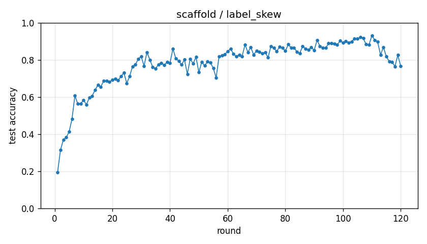

# Experiment report -- scaffold / label_skew

## Configuration

| Key | Value |
|---|---|
| algorithm | scaffold |
| partition | label_skew |
| num_clients | 10 |
| classes_per_client | 2 |
| alpha | 0.1 |
| rounds | 120 |
| local_epochs | 5 |
| local_lr | 0.01 |
| batch_size | 64 |
| participation_rate | 1.0 |
| mu | 0.01 |
| global_lr | 1.0 |
| seed | 0 |
| device | cuda |
| output_dir | results/unified/u_scaffold_K10_long |
| log_every | 1 |

## Partition

- Number of clients with data: **10**
- Samples per client: min=3019, median=4673, max=12593, total=60000

## Results

- Final test accuracy (round 120): **0.7661**
- Best test accuracy: **0.9314** at round 110
- Final test loss: 0.6709
- Rounds to 0.90 acc: 91
- Rounds to 0.95 acc: not reached
- Wall clock: 3294.9s

## Per-round history

| Round | Test acc | Test loss | Clients |
|---|---|---|---|
| 1 | 0.1951 | 2.4101 | 10 |
| 2 | 0.3148 | 3.5794 | 10 |
| 3 | 0.3701 | 3.0078 | 10 |
| 4 | 0.3822 | 2.1208 | 10 |
| 5 | 0.4132 | 1.8894 | 10 |
| 6 | 0.4819 | 1.5793 | 10 |
| 7 | 0.6070 | 1.1857 | 10 |
| 8 | 0.5643 | 1.3254 | 10 |
| 9 | 0.5636 | 1.4221 | 10 |
| 10 | 0.5837 | 1.3625 | 10 |
| 11 | 0.5597 | 1.5970 | 10 |
| 12 | 0.5963 | 1.4892 | 10 |
| 13 | 0.6062 | 1.4542 | 10 |
| 14 | 0.6377 | 1.2461 | 10 |
| 15 | 0.6658 | 1.0805 | 10 |
| 16 | 0.6556 | 1.1894 | 10 |
| 17 | 0.6881 | 1.0076 | 10 |
| 18 | 0.6860 | 1.0302 | 10 |
| 19 | 0.6822 | 1.0318 | 10 |
| 20 | 0.6928 | 0.9873 | 10 |
| 21 | 0.6990 | 0.9744 | 10 |
| 22 | 0.6891 | 1.0001 | 10 |
| 23 | 0.7117 | 0.8431 | 10 |
| 24 | 0.7298 | 0.7803 | 10 |
| 25 | 0.6744 | 1.0702 | 10 |
| 26 | 0.7131 | 0.8625 | 10 |
| 27 | 0.7649 | 0.6359 | 10 |
| 28 | 0.7742 | 0.6189 | 10 |
| 29 | 0.8059 | 0.5185 | 10 |
| 30 | 0.8183 | 0.4901 | 10 |
| 31 | 0.7674 | 0.6519 | 10 |
| 32 | 0.8416 | 0.4245 | 10 |
| 33 | 0.8008 | 0.5611 | 10 |
| 34 | 0.7611 | 0.7026 | 10 |
| 35 | 0.7535 | 0.7777 | 10 |
| 36 | 0.7753 | 0.6719 | 10 |
| 37 | 0.7835 | 0.6664 | 10 |
| 38 | 0.7731 | 0.7194 | 10 |
| 39 | 0.7879 | 0.6714 | 10 |
| 40 | 0.7839 | 0.6491 | 10 |
| 41 | 0.8599 | 0.4007 | 10 |
| 42 | 0.8078 | 0.5556 | 10 |
| 43 | 0.7948 | 0.6159 | 10 |
| 44 | 0.7739 | 0.6985 | 10 |
| 45 | 0.8017 | 0.6061 | 10 |
| 46 | 0.7236 | 0.9032 | 10 |
| 47 | 0.8062 | 0.5677 | 10 |
| 48 | 0.7798 | 0.6415 | 10 |
| 49 | 0.8151 | 0.5296 | 10 |
| 50 | 0.7329 | 0.8512 | 10 |
| 51 | 0.7895 | 0.6205 | 10 |
| 52 | 0.7685 | 0.6992 | 10 |
| 53 | 0.7903 | 0.6019 | 10 |
| 54 | 0.7861 | 0.6053 | 10 |
| 55 | 0.7546 | 0.7389 | 10 |
| 56 | 0.7046 | 0.9716 | 10 |
| 57 | 0.8187 | 0.5432 | 10 |
| 58 | 0.8252 | 0.5286 | 10 |
| 59 | 0.8298 | 0.5228 | 10 |
| 60 | 0.8460 | 0.4755 | 10 |
| 61 | 0.8602 | 0.4266 | 10 |
| 62 | 0.8329 | 0.5270 | 10 |
| 63 | 0.8186 | 0.5535 | 10 |
| 64 | 0.8282 | 0.5163 | 10 |
| 65 | 0.8195 | 0.5493 | 10 |
| 66 | 0.8816 | 0.3521 | 10 |
| 67 | 0.8414 | 0.4825 | 10 |
| 68 | 0.8685 | 0.3906 | 10 |
| 69 | 0.8282 | 0.5442 | 10 |
| 70 | 0.8495 | 0.4539 | 10 |
| 71 | 0.8425 | 0.4886 | 10 |
| 72 | 0.8353 | 0.5071 | 10 |
| 73 | 0.8407 | 0.4915 | 10 |
| 74 | 0.8131 | 0.6018 | 10 |
| 75 | 0.8747 | 0.3846 | 10 |
| 76 | 0.8644 | 0.4075 | 10 |
| 77 | 0.8459 | 0.4840 | 10 |
| 78 | 0.8705 | 0.3874 | 10 |
| 79 | 0.8648 | 0.4158 | 10 |
| 80 | 0.8479 | 0.4836 | 10 |
| 81 | 0.8833 | 0.3558 | 10 |
| 82 | 0.8655 | 0.4210 | 10 |
| 83 | 0.8656 | 0.4107 | 10 |
| 84 | 0.8437 | 0.4991 | 10 |
| 85 | 0.8361 | 0.5357 | 10 |
| 86 | 0.8745 | 0.3914 | 10 |
| 87 | 0.8597 | 0.4444 | 10 |
| 88 | 0.8545 | 0.4607 | 10 |
| 89 | 0.8673 | 0.4171 | 10 |
| 90 | 0.8524 | 0.4777 | 10 |
| 91 | 0.9059 | 0.2956 | 10 |
| 92 | 0.8732 | 0.4279 | 10 |
| 93 | 0.8658 | 0.4501 | 10 |
| 94 | 0.8650 | 0.4485 | 10 |
| 95 | 0.8890 | 0.3585 | 10 |
| 96 | 0.8897 | 0.3614 | 10 |
| 97 | 0.8875 | 0.3675 | 10 |
| 98 | 0.8814 | 0.3894 | 10 |
| 99 | 0.9033 | 0.3106 | 10 |
| 100 | 0.8915 | 0.3587 | 10 |
| 101 | 0.9010 | 0.3213 | 10 |
| 102 | 0.8914 | 0.3650 | 10 |
| 103 | 0.8987 | 0.3392 | 10 |
| 104 | 0.9143 | 0.2777 | 10 |
| 105 | 0.9150 | 0.2787 | 10 |
| 106 | 0.9217 | 0.2475 | 10 |
| 107 | 0.9166 | 0.2649 | 10 |
| 108 | 0.8836 | 0.3983 | 10 |
| 109 | 0.8808 | 0.4077 | 10 |
| 110 | 0.9314 | 0.2236 | 10 |
| 111 | 0.9069 | 0.2914 | 10 |
| 112 | 0.8975 | 0.3266 | 10 |
| 113 | 0.8269 | 0.5930 | 10 |
| 114 | 0.8691 | 0.4333 | 10 |
| 115 | 0.8181 | 0.5869 | 10 |
| 116 | 0.7925 | 0.6493 | 10 |
| 117 | 0.7896 | 0.6677 | 10 |
| 118 | 0.7649 | 0.7975 | 10 |
| 119 | 0.8259 | 0.5188 | 10 |
| 120 | 0.7661 | 0.6709 | 10 |

